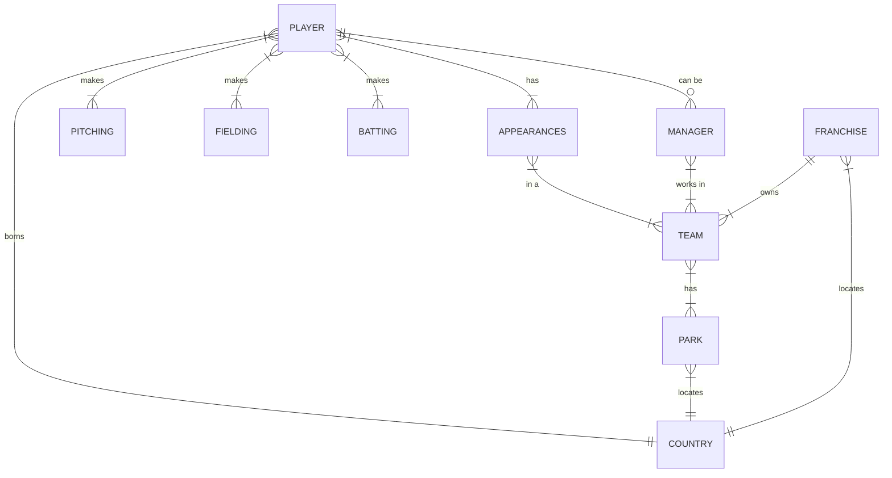

# BUx SBR101

sqlifying data from [Baseball Databank](https://github.com/chadwickbureau/baseballdatabank) while following [Sabermetrics 101: Introduction to Baseball Analytics](https://learning.edx.org/course/course-v1:BUx+SABR101x+2T2015/home) course

### Tables and database

From Baseball Databank:

